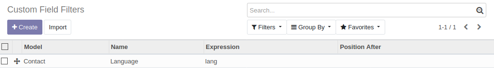

1.  Go to the menu entry for which you have defined the custom field
    filter.
2.  On the search bar, type anything.
3.  In the filter list, you will see the line for the element you have
    defined.

As demo data, a custom field filter is included for sample purposes:

Steps for trying this sample:

1.  Install contacts module.
2.  Go to *Contacts*.
3.  Type "english" and you'll find the filter "Language" at the end:

