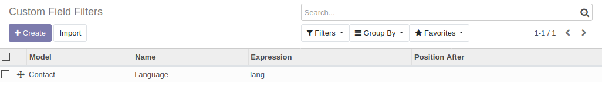
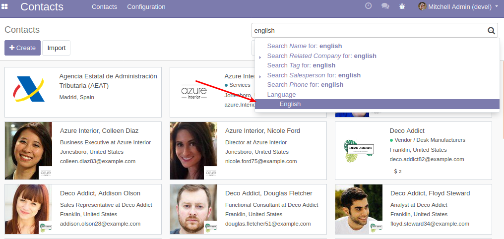

#. Go to the menu entry for which you have defined the custom field filter.
#. On the search bar, type anything.
#. In the filter list, you will see the line for the element you have defined.

As demo data, a custom field filter is included for sample purposes:

Steps for trying this sample:

#. Install `contacts` module.
#. Go to *Contacts*.
#. Type "english" and you'll find the filter "Language" at the end:

