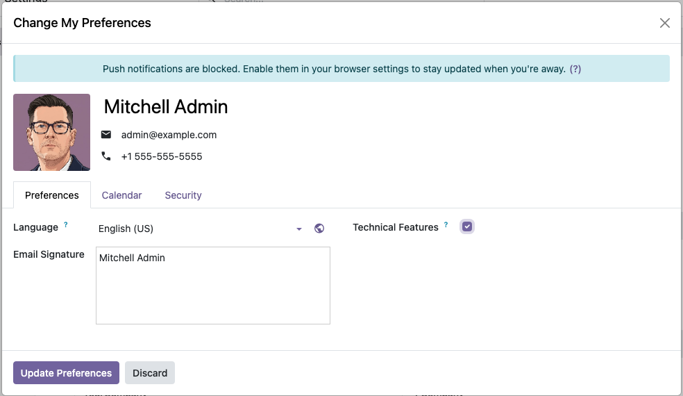

After installation of this module, every employee can still access technical features
for the applications that they have access to by enabling debug mode.

Additionally, users can check the *Technical Features* field in their preferences
(user menu, *My Preferences*, *Preferences* tab) and click *Update Preferences* to gain
permanent access to the menus and views that fall under this category.

Upon installation of this module, this preference is already set for the administrator
user of the database.

In the background, this preference is mapped to the *Technical Features (w/o debug mode)*
group that this module adds. As an administrator, you can therefore manage this
preference from the *Preferences* tab of the user form in *Settings > Users & Companies >
Users*, or from the group itself.
