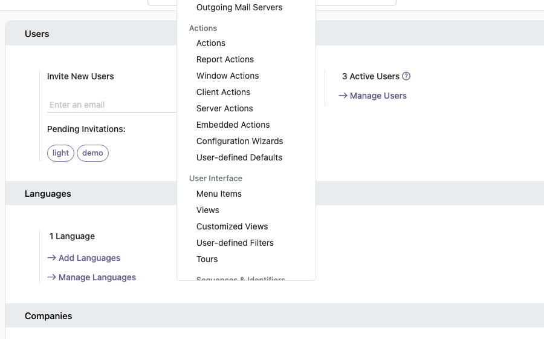

With the *Technical Features* preference checked, the menus and fields restricted to
debug mode are shown without activating it. For instance, the *Technical* menu of the
*Settings* app is available straight away:

Unchecking the preference hides them again, unless debug mode is activated.
