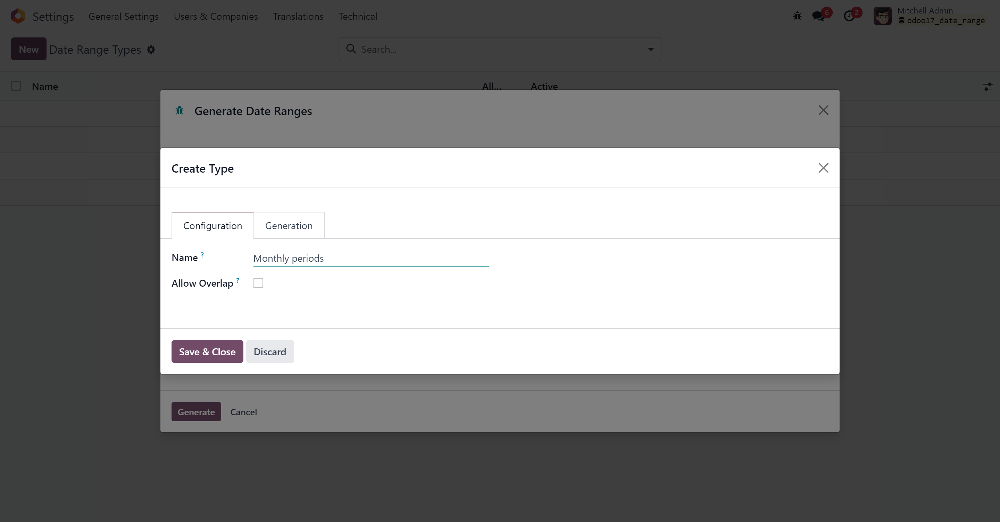
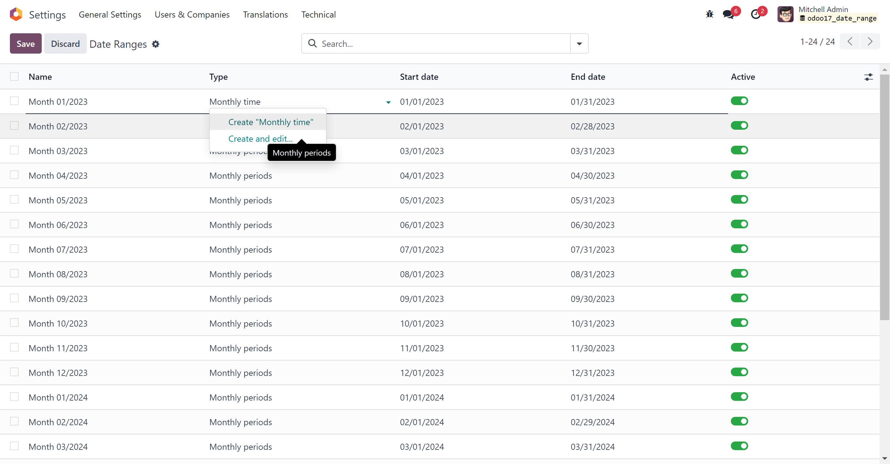
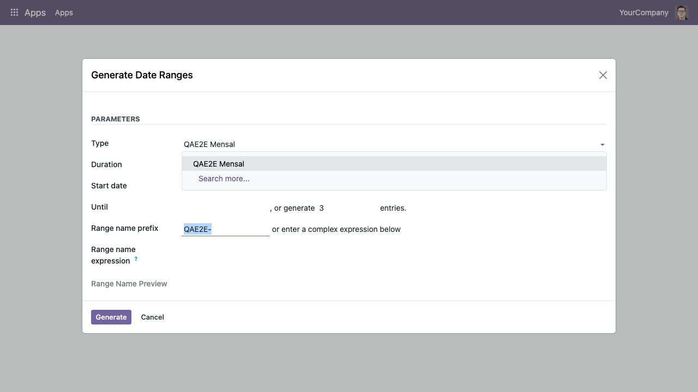
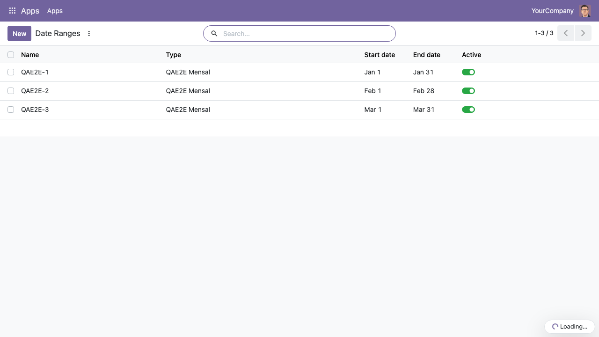
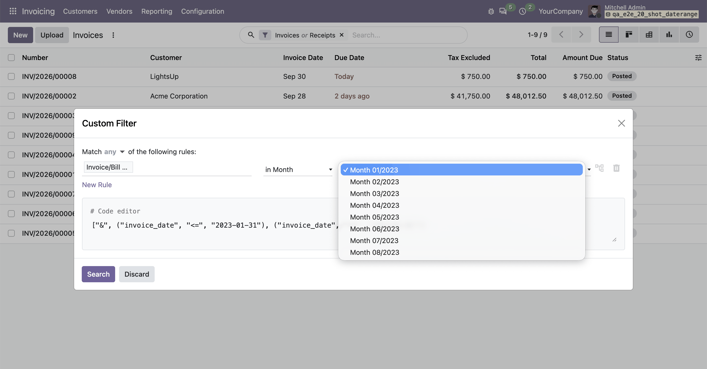
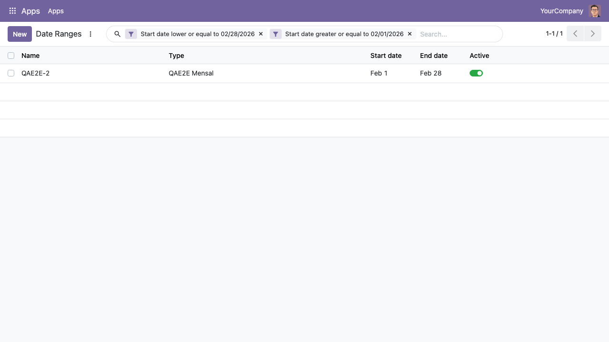
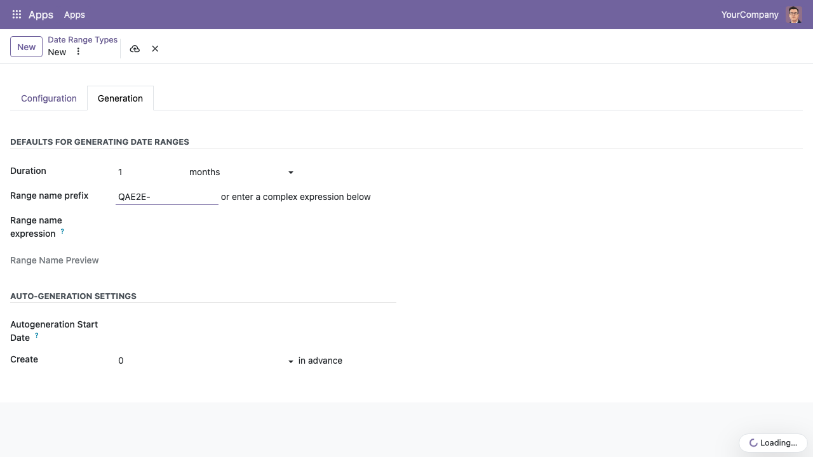

To configure this module, you need to:

- Go to Settings \> Technical \> Date ranges \> Date Range Types where
  you can create types of date ranges.

  

- Go to Settings \> Technical \> Date ranges \> Date Ranges where you
  can create date ranges.

  

  It's also possible to launch a wizard from the 'Generate Date Ranges'
  menu.

  

  The wizard is useful to generate recurring periods. Set an end date or
  enter the number of ranges to create. The duration, the unit of time,
  the name prefix and the start date are taken from the date range type.

  

- Your date ranges are now available in the custom filter for any date
  or datetime fields

  Date range types are proposed as a filter operator ("in \<type\>").
  Once a type is selected, date ranges of this type are proposed as a
  filter value

  

  And the dates specified into the date range are used to filter your
  result.

  

- You can configure date range types with default values for the
  generation wizard on the Generation tab. In the same tab you can also
  configure date range types for auto-generation. New ranges for types
  configured for this are generated by a scheduled task that runs daily.

  
