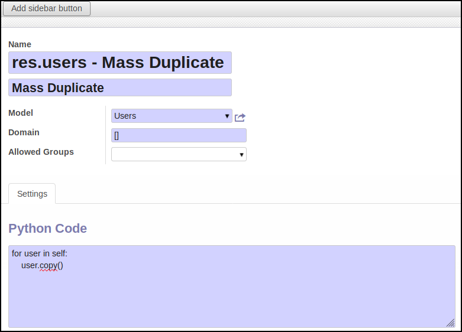

* Go to 'Setting / Technical / Mass Operations / Mass Actions'

* Create a new item

* Set a name for your mass action, and another for the button that will appear
  on the target model for the end users

* choose a model

* In the Python code part, write the python code that will be executed for
  the selected items. The selected items are available in the ``self`` var.

* Once done, click on the 'Add Sidebar button' to generate a new 'More options'
  button.

**Extra options**

* you can define a domain, to limit the action to items that match
  with that domain
* you can define groups whose members will have access to that option
