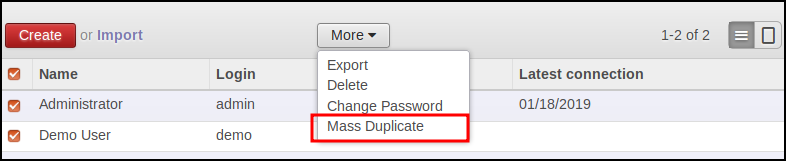
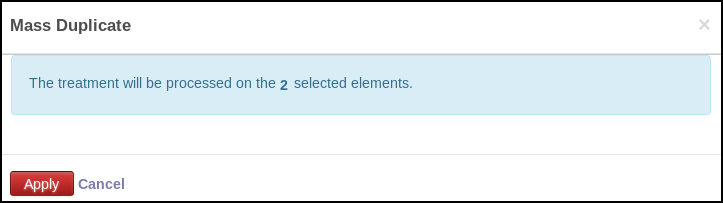
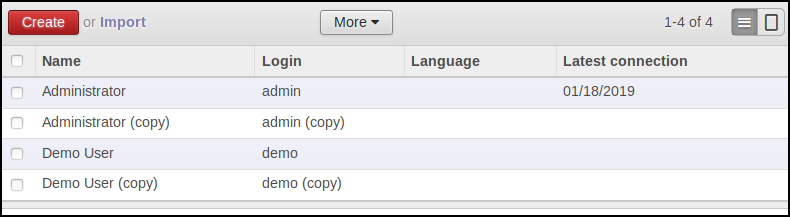

* go to the model for which you have configured a mass action

* select items and click on 'More' and on the new created button

* the opened pop up display the number of selected items

**Result**

The selected items will be processed. In that exemple, the selected users
will be duplicated.

