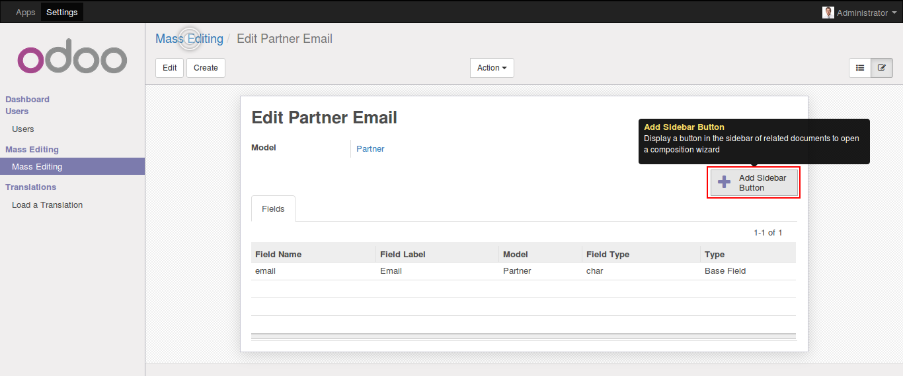
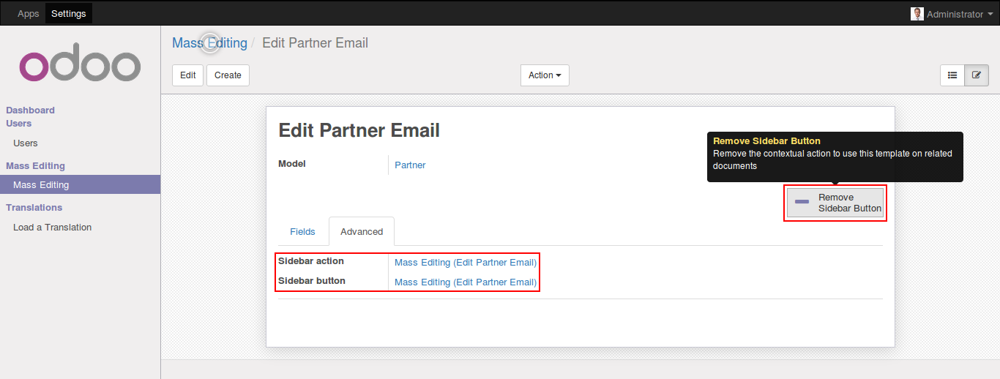
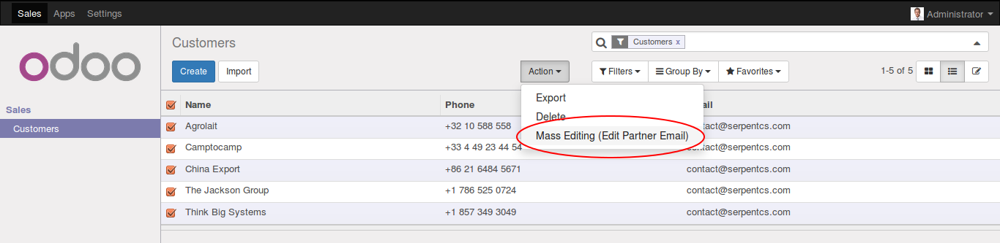
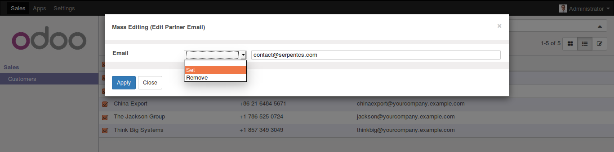
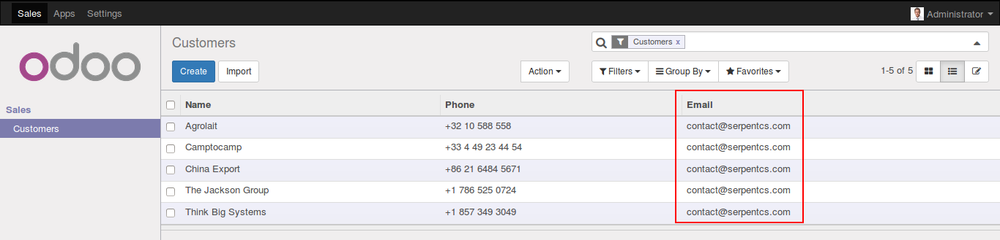

This module allows to add, update or remove the values of more than one records on the fly at the same time.

As shown in figure you have to configure the object and fields for mass editing.

* Select the object and add the fields of that object on which you want to apply mass editing.

* *Add Action*: As shown in figure click on *Add Sidebar Button* to add mass editing option in *Action* option in action.

* *Go for Mass Editing*: As shown in figure, select the records which you want to modify and click on *Action* to open mass editing popup.

* Select *Set / Remove* action and write down the value to set or remove the value for the given field.

* This way you can set / remove the values of the fields.

