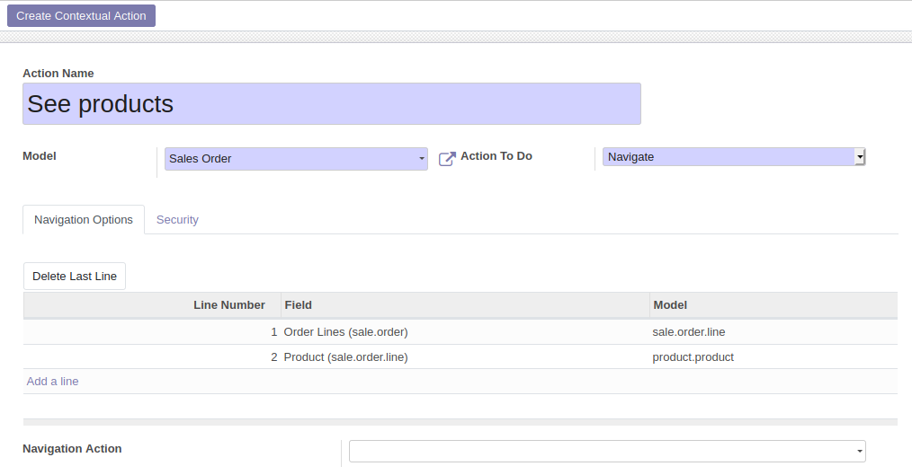

* Go to 'Setting / Technical / Actions / Server Actions'

* Create a new item

* Set a name that will be used for the Contextual Action

* choose a model

* Select 'Navigate' option in the field 'Action To Do'

* Then, select a field of this model. It can be a ``one2many``, ``many2many``,
  ``many2one`` field.

* You can then optionally select another fields (#2) that belong to the previous
  selected field (#1) relation model

* Once done, click on the 'Create Contextual Action' to generate a new 'More options'
  button.

**Extra options**

* you can define groups whose members will have access to that option.

* You can select an action that will be used to display the target field list.
