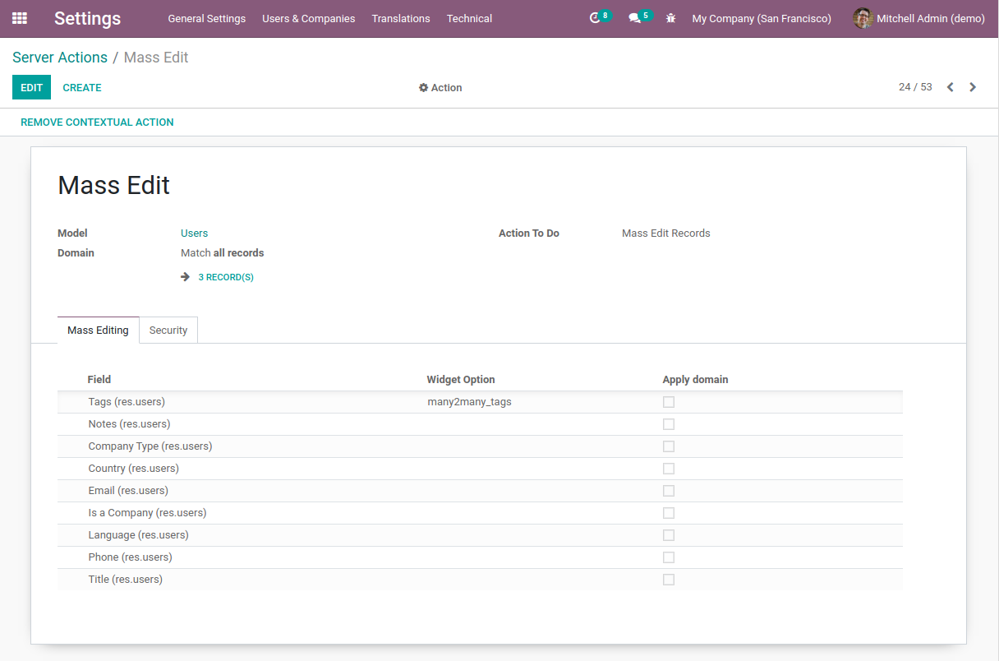

- In developer mode, go to *Settings / Technical / Actions / Server Actions*
- Create a new server action
- Name the server action (ie. *Product Template Category Mass Editing*)
- Choose Type *Mass Edit Records*
- Select the model
- Add the security groups allowed to use this action
- Add the fields you want to be mass edited

- *Add Action*: Click on *Create Contextual Action* to add mass editing
  in *Action* menu.

**Options**

- You can setup the widget option to be displayed (ie many2many_tags, selection_image...)
- You can tick Apply Domain allowing you to limit the mass editing action with a domain.
- You can add an extra message that will be displayed in the wizard.
