As a user from the access group *Administration / Settings*, in debug mode, go to *Settings / Technical / Actions / Server Actions* and create a new *Server Action*.
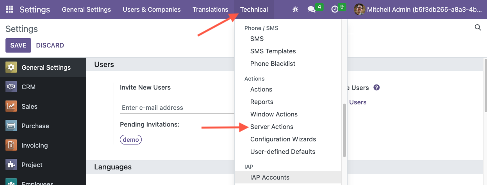

In the field *Action To Do*, choose the new option *Mass Edit Records*. 
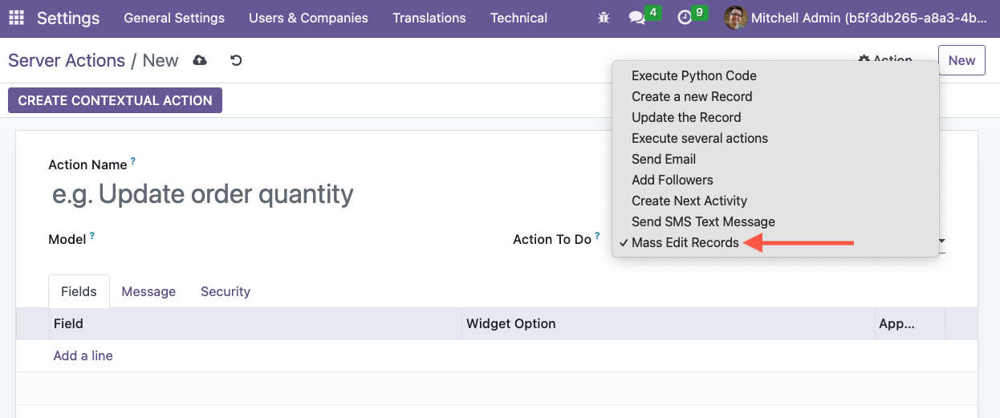

Select the model on which you want to configure this action and give a name to your server action.
***TIP***  
Name your action *“Mass Edit : Object Functional Name”*
**e.g.** *Mass Edit : Contact (or Partner)*

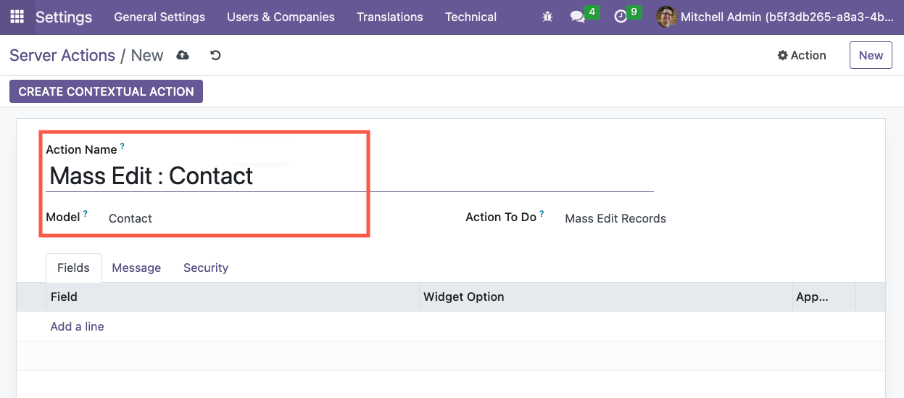

Add the fields you want to be able to edit.
You can search and filter all the fields available by clicking on *Search more*.
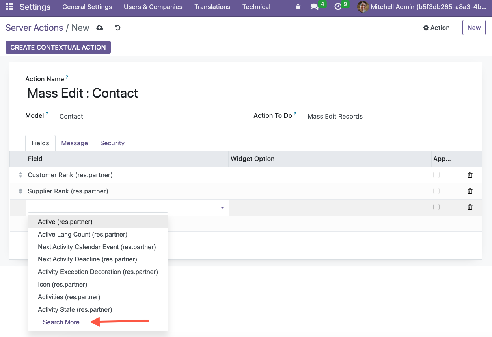

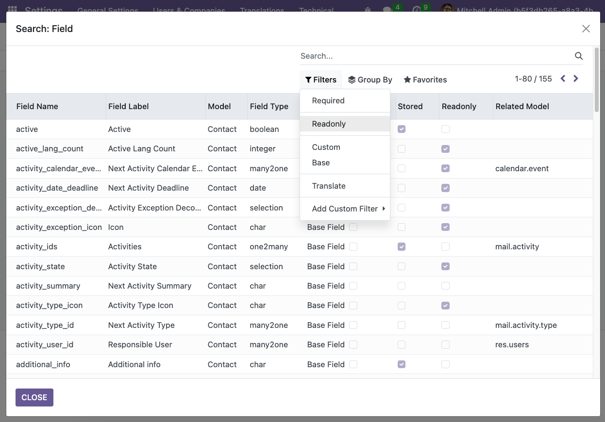

Click on *Create Contextual Action* to add the Mass Editing in the *Action* menu.
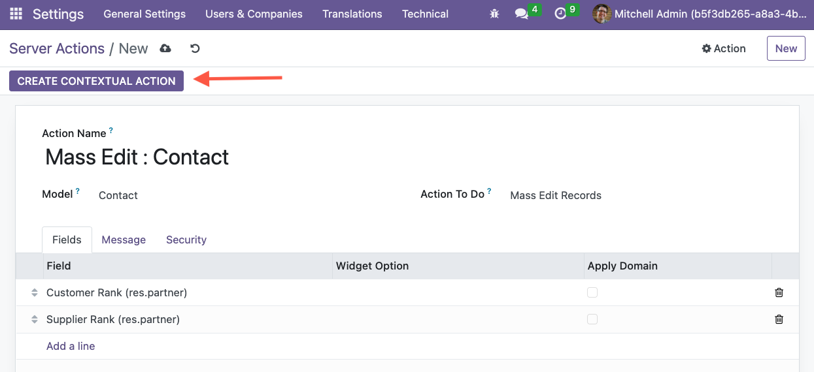

## V11 to V13 Access
### Access to the feature in V11 to V13
As a user from the access group *Administration / Settings*, go to *Settings / Mass Operations / Mass Editing*.
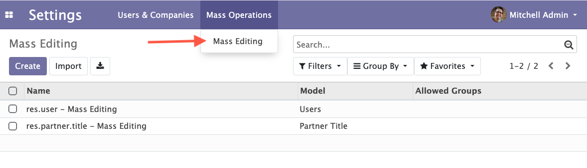

## Widget Option
This option allows you to choose the widget to be used in the mass editing action window.
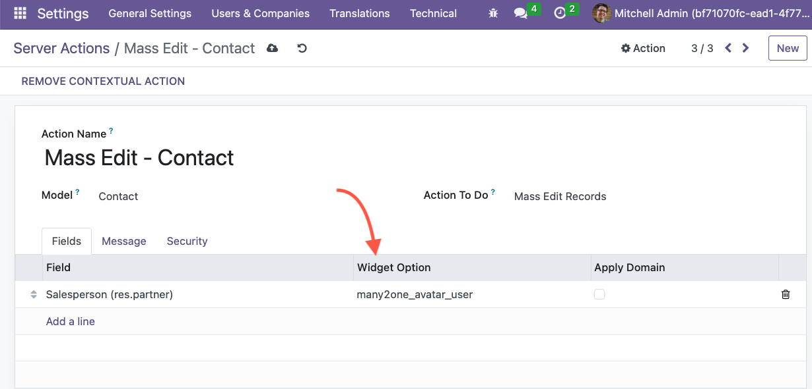

## Apply Domain
This option allows you to apply the default domain related to the selected field.
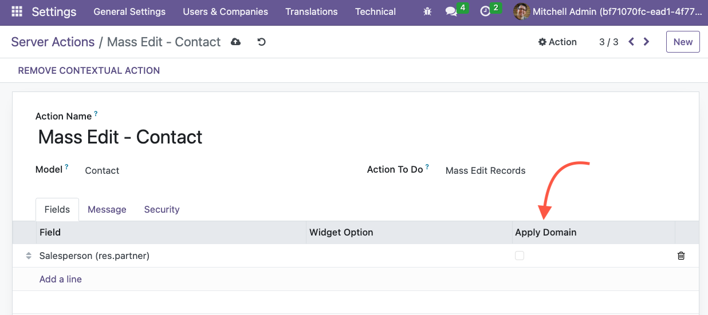

## Adding a Message
You can add a *“Message”* to guide the users when using this action.
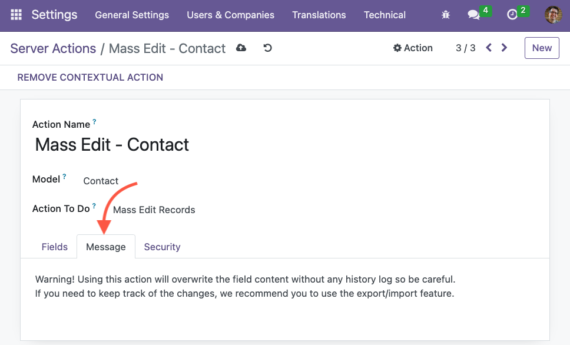

## Adding Security Access Groups
Go to the *Security* tab and add the *Access Group(s)* who can use this action.
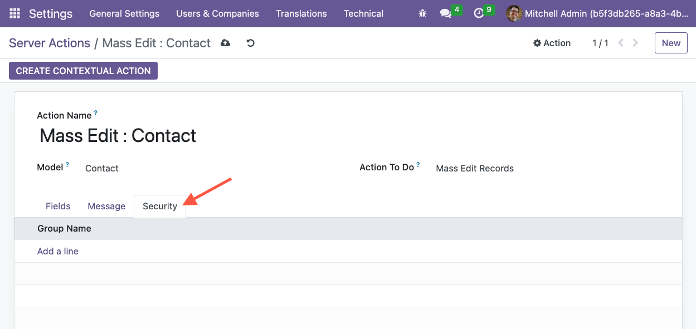

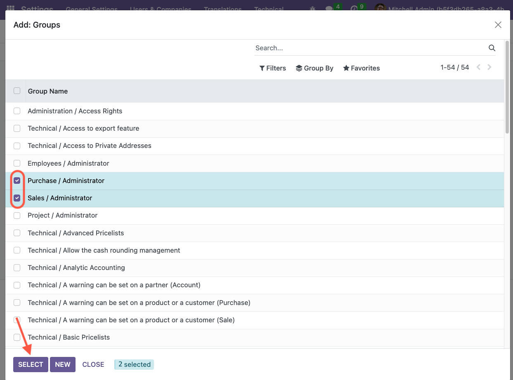
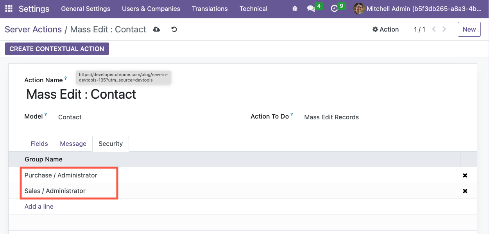

Now, only users from those groups will be able to see and use this action.
