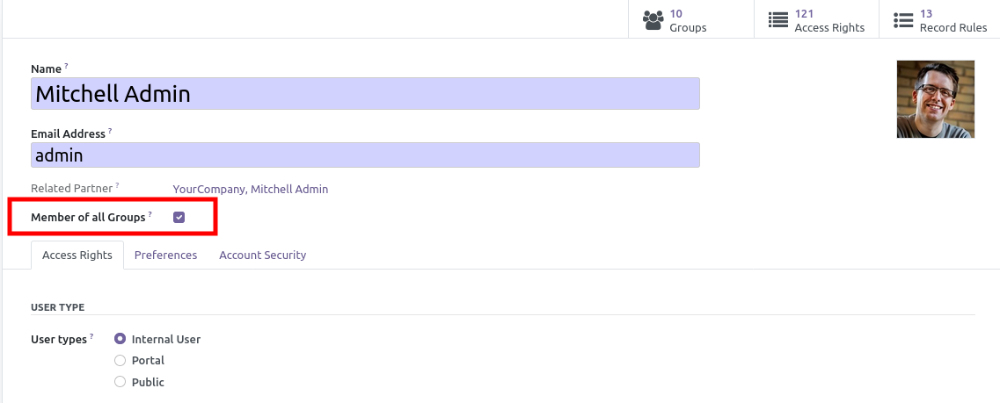

This module extends the base Odoo module, adding a new field on user form view
named 'Member of all Groups'.

If checked, the user will belong to all the groups (``res.groups``) and if a new module
is installed, the user(s) will automatically belong to the new created groups.

This feature can be interesting:

- on production, if you have some 'admin' users that want to access all features.

- in a development environment, when testing or developing new modules, to avoid fastidious
  initial configuration.

**Note**

- In Odoo Core, some groups are exclusive. This is the case for the three base groups
  "Access Rights / Portal / Public" and the two account groups "Tax display B2B / Tax display B2C".
  Users marked as "Member of all Groups" are NOT added to these exclusive groups.

- You could also be interested by another module named ``base_technical_features``
  in the same OCA repository.

- If you want to always have this feature installed when developing new module
  you could consider use ``module_change_auto_install`` module
  in the OCA / server-tools repository.
